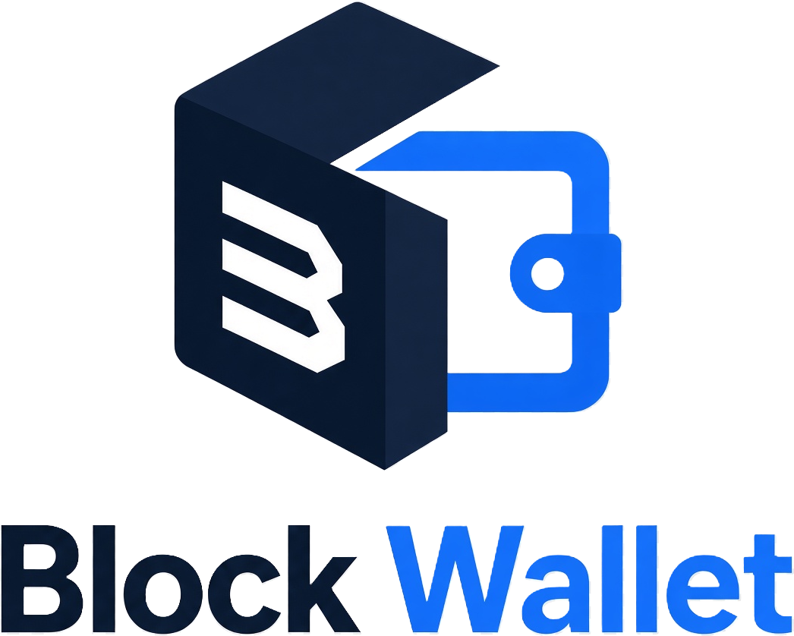
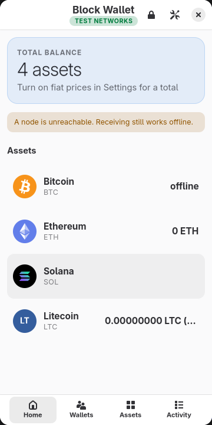
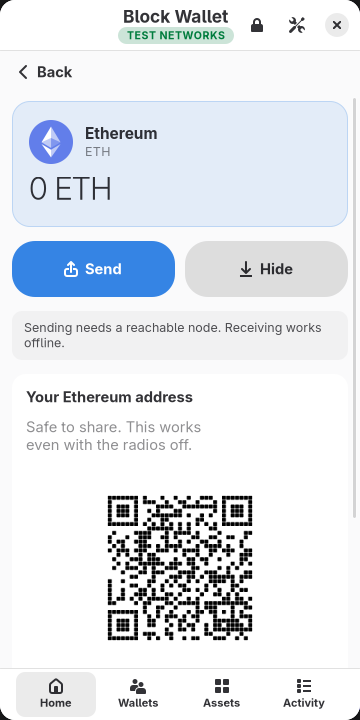
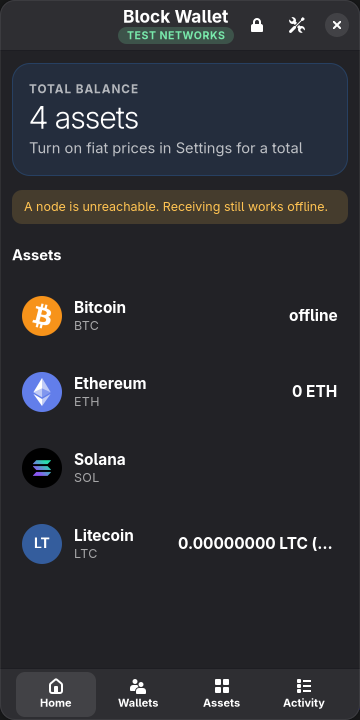
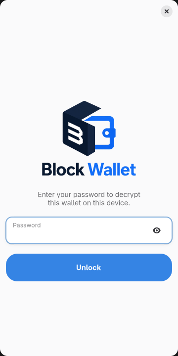
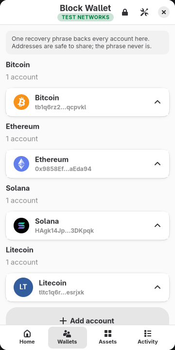
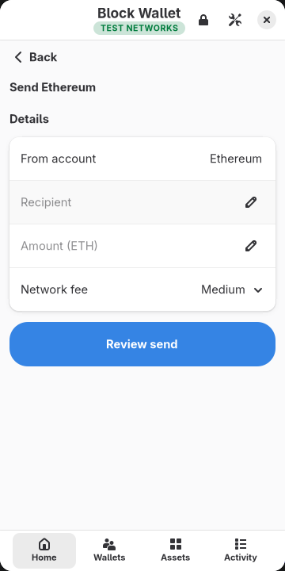
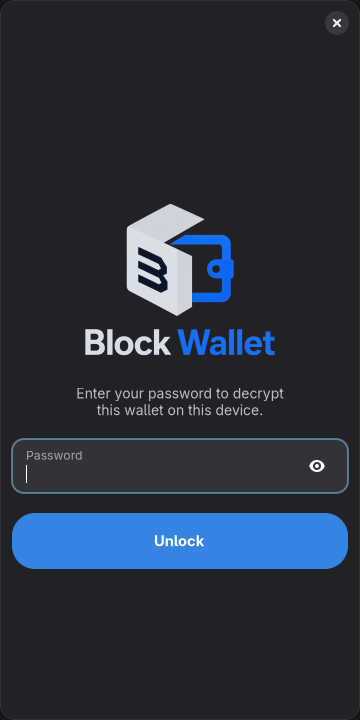
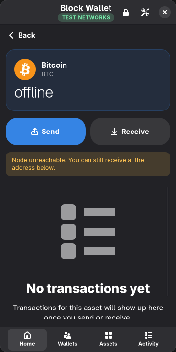

<p align="center">
  
</p>

<p align="center">
  Self-custody Bitcoin, Ethereum, Solana and Litecoin wallet for the
  <a href="https://puri.sm/products/librem-5/">Librem 5</a> (PureOS / Phosh)
  and other GTK4 Linux desktops.
</p>

<p align="center">
  
  
  
</p>

**Status:** v0.1.0 completed its [Librem 5 checklist](docs/LIBREM5.md) on PureOS 11 (Crimson)
in August 2026: all 41 checks passed on real hardware. Development has continued since, so the
current tree is ahead of that verified point and is being re-tested against an expanded
checklist.

Known unproven areas, stated plainly rather than buried: THORChain swaps have never moved real
coins, because the network's global trading halt has been in force throughout; swap quoting is
only exercisable on mainnet, since no testnet has aggregator liquidity; and the Activity view
was not visually confirmed during a network outage. See the checklist for the full record.

Application ID: `io.github.BlockBreakersHQ.BlockWallet`

---

## What it is

Block Wallet is a wallet you actually hold the keys to, built for a Linux phone.

**One recovery phrase, four chains.** A single BIP39 phrase derives every account: Bitcoin
(BIP84 `bc1q…`), Ethereum (BIP44), Solana (SLIP-0010 ed25519) and Litecoin. There is no
account to create, no email, no KYC, and nothing to sign up for. Write the phrase down and
that is the whole backup.

**Your keys never leave the device.** The store is a single encrypted file — Argon2id at
64 MiB for the password, ChaCha20-Poly1305 for the contents — written owner-only under your
XDG data directory, and replaced atomically so an interrupted save cannot corrupt it.
Anyone who copies that file can attack it offline at their own pace, so how strong a password
you pick is what protects it. Every copy of your keys is wiped from memory when it goes out of
scope, not just the one the lock button reaches. The Flatpak sandbox is *not* granted access
to your home directory, so even the packaged build can only see its own data. Logs are short
context strings that never contain a phrase, key or password.

**Your nodes, not ours.** Every chain talks to an endpoint you choose: an Electrum or
Esplora server for Bitcoin, any JSON-RPC for Ethereum and Solana, an Esplora-style server
for Litecoin. The defaults are public endpoints so it works out of the box, but those
endpoints see which addresses you ask about — point it at your own server in Settings and
that stops. Remote endpoints must use TLS; plaintext `http://` is accepted only for a node
running on the device itself. Nothing a node says is taken on trust: fee estimates are
capped, and a fee larger than the amount being sent is refused rather than shown.

**Receiving works with the radios off.** Addresses and QR codes are derived locally, so
the receive screen is fully usable in airplane mode or when a node is unreachable. The app
says so plainly rather than showing a spinner.

**It tries hard not to let you lose money.** Any network that spends real value requires an
explicit "I understand" checkbox before the Confirm button becomes active — and that gate
keys off *"is this a known testnet"*, not *"is this literally mainnet"*, so a newly added
L2 defaults to protected rather than unprotected. Consent is per send, not per screen: the
box is unticked again for every transaction. What you confirm is always what you reviewed —
changing the recipient, amount, fee or account tears the review card down rather than
leaving Confirm wired to the previous plan, and each plan is bound to the account it was
built for, so it cannot be signed by another. The header carries a permanent LIVE or TEST
NETWORKS chip so the answer is never more than a glance away.

**It is shaped like a phone app.** 360×720, touch-sized targets, a bottom tab bar, and
libadwaita's own patterns throughout — boxed lists, preference groups, status pages,
toasts. It follows the system light/dark theme and accent colour.

## Screens

| | | |
|:--:|:--:|:--:|
|  |  |  |
| Unlock | Home | Accounts, one phrase behind all of them |
|  |  |  |
| Receive — works offline | Send | Dark mode |
|  |  | |
| Home in dark mode | Asset detail in dark mode | |

Captured at 360×720, the Librem 5's logical resolution.

## Supported chains

| Chain | Derivation | Networks | Notes |
| --- | --- | --- | --- |
| **Bitcoin** | BIP84 `m/84'/0'/0'/0/0` | mainnet, testnet | BDK 1.x, Electrum or Esplora, fee tiers, RBF-ready PSBT flow |
| **Ethereum** | BIP44 `m/44'/60'/0'/0/0` | mainnet, Sepolia, **Arbitrum One, Base, Optimism, Polygon PoS, BNB Smart Chain, Avalanche C-Chain** | Alloy. One address across all of them. Native gas token follows the chain (ETH / MATIC / BNB / AVAX) |
| **Solana** | SLIP-0010 ed25519 `m/44'/501'/0'/0'` | mainnet, devnet | SOL and SPL tokens, hand-rolled transaction format — no `solana-sdk` dependency |
| **Litecoin** | BIP84-style `m/84'/2'/0'/0/0` | mainnet, testnet | Hand-rolled: no Litecoin fork of `bitcoin`/`bdk_wallet` exists on crates.io, so this reuses the project's BIP32/secp256k1/BIP143 code and adds Litecoin's own bech32 and WIF encoding |

Tokens: a bundled list (USDC, USDT, DAI, WBTC, SPL USDC, plus each L2's native token and a
stablecoin), and you can add any ERC-20 by contract or any SPL token by mint address.

Import from a mnemonic, a WIF, a raw private key, or an existing encrypted `.dic`.

## Swaps

Swaps are non-custodial. No company ever holds your coins, and every transaction is signed on
the device.

Several venues are asked at once and their offers ranked by what you actually receive:

| Venue | Covers | Custody |
| --- | --- | --- |
| **LI.FI** | Same-chain swaps on Ethereum and every supported L2 | Settles in one transaction |
| **Jupiter** | Same-chain swaps on Solana, SOL and SPL tokens | Settles in one transaction |
| **THORChain** | Cross-chain: BTC, LTC and ETH-family assets | A protocol vault holds the inbound side until the outbound side settles |

Bitcoin and Litecoin have no on-chain DEX, so THORChain is the only route for them. That means
the funds are briefly out of your control between the two legs, which the app says plainly on
the offer and again on the review screen before you can confirm.

What the wallet checks before it will sign, on every offer:

- the proceeds are addressed to your own wallet, verified against the THORChain memo itself
  rather than the provider's claim about it;
- a minimum output exists and implies no more slippage than you allowed;
- the amount clears the provider's own minimum, since THORChain forfeits rather than refunds
  anything below it;
- the quote has not expired;
- ERC-20 approvals are for exactly the swap amount and only to the contract being called, so
  no standing allowance is left behind;
- a Solana transaction built elsewhere is payable only by your own account.

Providers that decline say why rather than quietly disappearing. THORChain in particular
refuses while the network is halted, which it has been throughout development. That means the
THORChain path is unit-tested but has never moved real coins.

Swap quotes go through a THORNode endpoint you can set in **Settings -> Swaps**.

## Install

### Flatpak (recommended)

The Flatpak carries its own GNOME 50 runtime, so it does not depend on what the distribution
ships and behaves the same on every PureOS release.

| PureOS | Base | Native GTK4 / libadwaita | Native build |
| --- | --- | --- | --- |
| Byzantium | Debian bullseye | none | not possible |
| **Crimson** | Debian bookworm | GTK 4.8.3, libadwaita 1.2.2 | possible, but see [From source](#from-source) |

Verified on a Librem 5 running **PureOS 11 (Crimson)**, kernel 6.12.0-1-librem5: the aarch64
bundle installs, appears in the Phosh app grid, and runs with no errors on stderr and a flat
57 MB resident. Note that this exercises the runtime's GTK 4.22, not Crimson's own 4.8.3.
Those are separate code paths, and only the Flatpak one has been run on hardware.

From a built bundle:

```sh
flatpak install --user ./blockwallet-aarch64.flatpak
flatpak run io.github.BlockBreakersHQ.BlockWallet
```

From a hosted repo:

```sh
flatpak remote-add --if-not-exists --user blockwallet https://example.org/repo/blockwallet.flatpakrepo
flatpak install --user blockwallet io.github.BlockBreakersHQ.BlockWallet
flatpak run io.github.BlockBreakersHQ.BlockWallet
```

Building the bundle yourself is covered in [docs/packaging.md](docs/packaging.md).

### From source

Needs Rust 1.85+, GTK 4.6+, and libadwaita 1.2+.

```sh
# Debian bookworm / trixie, PureOS Crimson
sudo apt install build-essential pkg-config libgtk-4-dev libadwaita-1-dev libssl-dev

cargo build --release
cargo test
```

**On PureOS Crimson the distribution's Rust is too old.** Crimson's `rustc` is 1.63 and this
crate needs 1.85, so install a toolchain from [rustup](https://rustup.rs) rather than
`apt install rustc cargo`. The GTK side is fine: Crimson's GTK 4.8.3 and libadwaita 1.2.2
both clear the floor, and `libgtk-4-dev` / `libadwaita-1-dev` are in its repositories.

That libadwaita floor is deliberate. `Cargo.toml` pins the `v1_2` feature and
`ui::add_switch_row` hand-builds what `AdwSwitchRow` would give, precisely so this still
compiles against the 1.2.2 that Crimson ships. Raising it to `v1_4` would break the native
build on the device this app targets.

Building on the phone itself is slow: 4 cores and 3 GB of RAM against roughly 580 crates.
Prefer building on a faster machine and copying the result over.

Windows (MSYS2 mingw64 + GNU rustc) — plain `cargo run` uses MSVC and has no
`pkg-config`/GTK, so use the wrapper:

```powershell
.\scripts\run-windows.ps1
```

## Trying it safely

`BLOCKWALLET_HOME` relocates the entire profile, so a test run cannot touch an existing
wallet:

```sh
BLOCKWALLET_HOME=~/blockwallet-test RUST_LOG=debug block_wallet
```

Turn on **Settings → Use test networks** for Bitcoin testnet, Ethereum Sepolia, Solana
devnet and Litecoin testnet in one switch. The header chip turns green.

## Data locations

User files follow the XDG Base Directory spec. Override the root with `BLOCKWALLET_HOME`.

| What | Linux default | Flatpak |
| --- | --- | --- |
| Encrypted wallet (`Config.dic`) | `~/.local/share/blockwallet/` | `~/.var/app/io.github.BlockBreakersHQ.BlockWallet/data/blockwallet/` |
| Network settings (`network.yml`) | `~/.config/blockwallet/` | `…/config/blockwallet/` |
| Log (`blockwallet.log`) | `~/.local/state/blockwallet/` | `…/data/blockwallet/` |
| Backups | `~/.local/share/blockwallet/backups/` | `…/data/blockwallet/backups/` |

## Packaging and device QA

- Flatpak manifests: `data/io.github.BlockBreakersHQ.BlockWallet.json` (release, offline
  vendored build) and `…Devel.json` (local iteration)
- Debian/PureOS sketch: `packaging/debian/`
- How to build and install: [docs/packaging.md](docs/packaging.md)
- Pre-submission checks: `./scripts/validate-packaging.sh`
- Librem 5 manual checklist: [docs/LIBREM5.md](docs/LIBREM5.md)

Progress and remaining work: [docs/ROADMAP.md](docs/ROADMAP.md).

After the device checklist passes:

```sh
git tag v0.1.0
```

## License

[GNU General Public License v3.0 or later](LICENSE).
